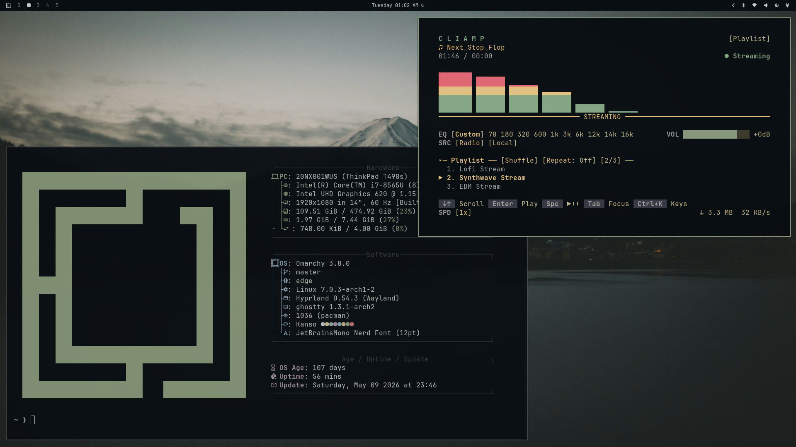

# Kanso - Barebone

A minimal Omarchy theme with calm Kanagawa-inspired colors for a clean, low-noise desktop.



## Install

#### Requirements: Omarchy environment (Hyprland + Waybar setup).
#### To install this theme, simply use the omarchy-theme-install command:

```bash
omarchy-theme-install https://github.com/minhajshafin/Kanso.git
```

## Included

- `hyprland.conf` - Hyprland settings
- `waybar.css` - Waybar styling
- `colors.toml` - shared colors
- `neovim.lua` - Neovim theme config
- `vscode.json` - VS Code theme settings
- `*.theme`, `swayosd.css`, `backgrounds/` - app/theme assets

## Credits

- Original base: [HANCORE](https://github.com/HANCORE-linux/omarchy-kanso-theme.git)
- This repo: stripped-down and adjusted for a barebone Omarchy setup

## License

Licensed under the terms in [LICENSE](LICENSE).

